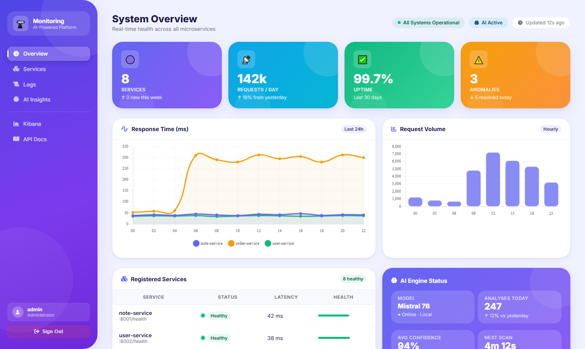
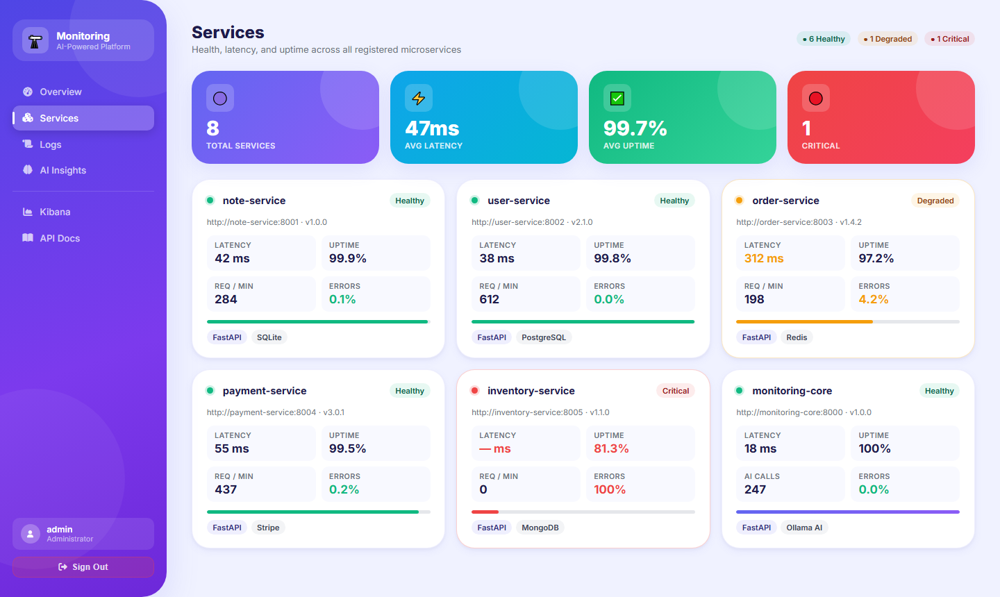
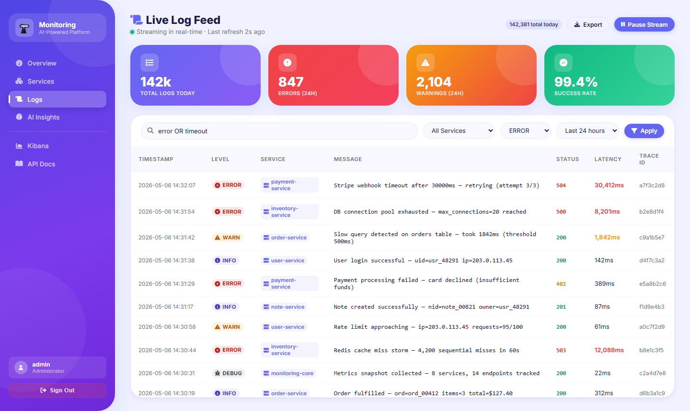
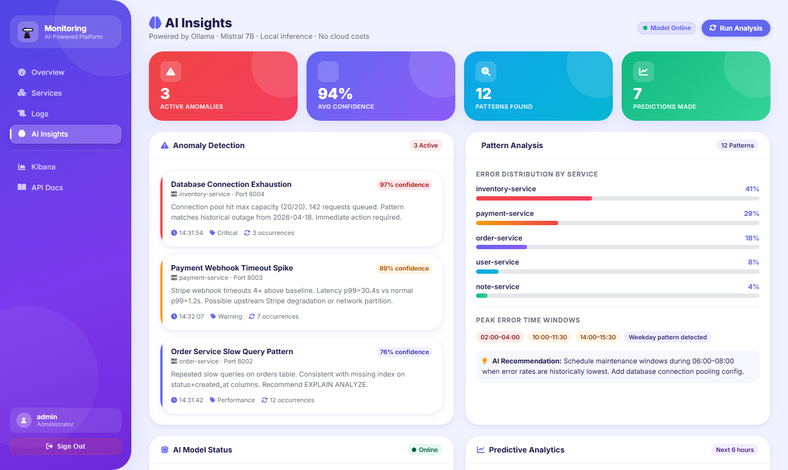
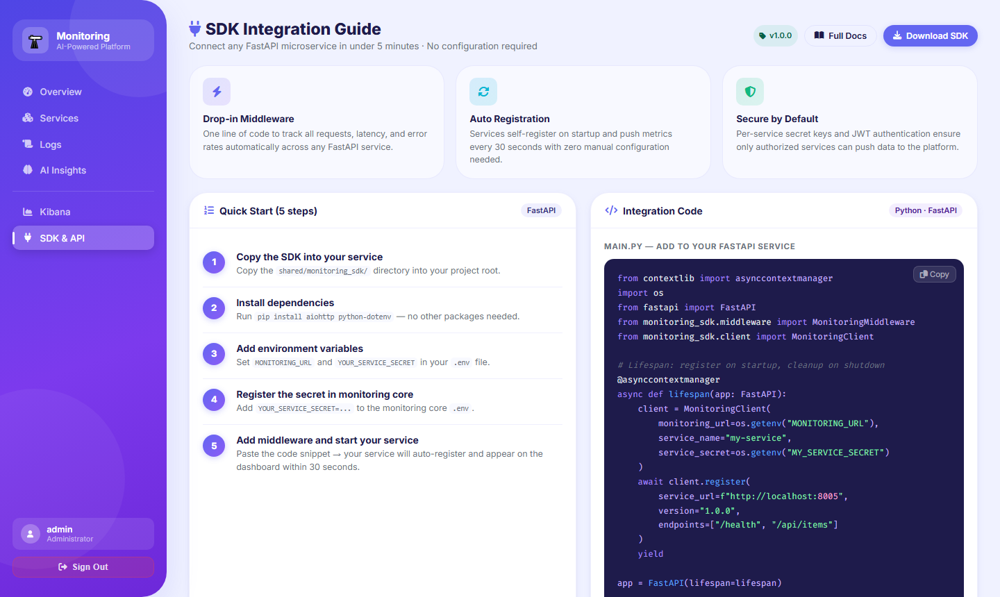

# AI-Powered Microservices Monitoring Platform 🔭

A production-ready **centralized monitoring and observability platform** for microservices, featuring local AI-driven anomaly detection, pattern analysis, and intelligent log summarization — powered by [Ollama](https://ollama.com) with zero cloud AI costs.

> **Stack:** FastAPI · Elasticsearch · Kibana · Redis · Ollama (Mistral / LLaMA2) · Docker

---

## Architecture

```
┌──────────────────────────────────────────────────────────────┐
│              Monitoring Core  (port 8000)                    │
│                                                              │
│  ┌──────────────┐  ┌──────────────┐  ┌──────────────────┐   │
│  │  REST API    │  │  Dashboard   │  │   AI Engine      │   │
│  │  /api/v1/    │  │  (Jinja2)    │  │  Ollama / LLM    │   │
│  └──────────────┘  └──────────────┘  └──────────────────┘   │
│         │                                     │              │
│  ┌──────▼──────────────────────────────────── ▼──────────┐   │
│  │         Elasticsearch  (logs · metrics · anomalies)   │   │
│  └───────────────────────────────────────────────────────┘   │
└──────────────────────────────────────────────────────────────┘
         ▲  register + push metrics every 30s
         │
┌────────┴──────────┐    ┌───────────────────┐
│  Note Service     │    │  Your Services    │
│  (port 8001)      │    │  user / order /   │
│  Example service  │    │  payment / …      │
└───────────────────┘    └───────────────────┘
```

**Infrastructure services:** Elasticsearch · Kibana · Redis · Ollama · Nginx

---

## Features

### 🤖 AI-Powered Analysis
- **Anomaly Detection** — Ollama LLM analyzes log summaries for error spikes, latency issues, suspicious activity
- **Pattern Analysis** — Temporal, service, error, endpoint, and user pattern recognition
- **Log Summarization** — Multiple modes: general, error focus, performance, security
- **Predictive Analytics** — Trend forecasting based on historical metrics

### 📊 Observability
- Centralized log collection from all microservices via REST API
- Real-time health checks and service status tracking
- CPU, memory, response time, and error rate metrics
- Kibana dashboards for deep log exploration

### 🔌 Shared SDK
- Drop-in middleware for any FastAPI microservice (`shared/monitoring_sdk/`)
- Service auto-registration with monitoring core
- Automatic metrics push every 30 seconds

### 🔒 Security
- JWT-based authentication
- Per-service secret keys for API authentication
- All credentials managed via environment variables

---

## Screenshots

### Dashboard Overview


### Services Health


### Live Log Feed


### AI Engine & Anomaly Detection


### SDK Integration Guide


---

## Quick Start

### Prerequisites

- [Docker](https://docs.docker.com/get-docker/) + Docker Compose
- Python 3.11+ (for running scripts locally)

### 1. Clone & configure

```bash
git clone https://github.com/israfeelmasum/AI-Powered-Microservices-Monitoring-Platform.git
cd AI-Powered-Microservices-Monitoring-Platform

# Copy environment files
cp .env.example .env
cp microservices/note-service/.env.example microservices/note-service/.env
```

Edit `.env` and set your own credentials:

```env
ADMIN_USERNAME=admin
ADMIN_PASSWORD=your-strong-password

# Generate a secret key:
# python -c "import secrets; print(secrets.token_hex(32))"
SECRET_KEY=your-generated-secret-key

NOTE_SERVICE_SECRET=your-note-service-secret
```

### 2. Start all services

```bash
cd infrastructure
docker-compose up -d
```

### 3. Pull AI models

```bash
docker exec monitoring_ollama ollama pull mistral
docker exec monitoring_ollama ollama pull llama2
```

### 4. Initialize Elasticsearch indices

```bash
python scripts/create_indices.py
```

### 5. Open the dashboard

| Service | URL | Notes |
|---|---|---|
| Monitoring Dashboard | http://localhost:8000 | Admin credentials from `.env` |
| API Docs (Swagger) | http://localhost:8000/docs | |
| Kibana | http://localhost:5601 | |
| Note Service API | http://localhost:8001/docs | Example microservice |
| Elasticsearch | http://localhost:9200 | |

---

## Project Structure

```
AI-Powered-Microservices-Monitoring-Platform/
├── monitoring-core/          # Central monitoring service (FastAPI)
│   ├── app/
│   │   ├── ai/               # AI engine: anomaly_detector, pattern_analyzer,
│   │   │                     #            summarizer, predictor, ollama_client
│   │   ├── api/              # REST endpoints: metrics, health, monitoring, ai_insights
│   │   ├── auth/             # JWT authentication
│   │   ├── config/           # settings.py, secrets.py
│   │   ├── dashboard/        # Jinja2 templates + static assets
│   │   ├── middleware/        # Logging, metrics, tracing, health middleware
│   │   └── storage/          # Elasticsearch client and index config
│   ├── Dockerfile
│   ├── docker-compose.yml
│   └── requirements.txt
├── microservices/
│   └── note-service/         # Example microservice (CRUD notes, FastAPI)
│       ├── app/
│       │   ├── config/       # settings.py
│       │   ├── middleware/   # Monitoring middleware
│       │   ├── models/       # Pydantic models
│       │   └── routes/       # API routes
│       ├── Dockerfile
│       └── requirements.txt
├── shared/
│   └── monitoring_sdk/       # Reusable SDK for integrating any service
│       ├── client.py         # MonitoringClient
│       ├── middleware.py     # Drop-in FastAPI middleware
│       └── models.py         # Shared data models
├── infrastructure/
│   ├── docker-compose.yml    # Full stack orchestration
│   ├── elasticsearch/config/
│   ├── kibana/config/
│   ├── nginx/
│   └── ollama/models/
├── scripts/
│   ├── setup.sh              # Full automated setup
│   ├── create_indices.py     # Elasticsearch index creation
│   ├── setup_kibana.py       # Kibana dashboard setup
│   └── seed_data.py          # Generate sample monitoring data
├── docs/
│   ├── API.md
│   ├── ARCHITECTURE.md
│   └── DEPLOYMENT.md
├── .env.example              # Environment variable template
└── .gitignore
```

---

## Integrating Your Own Microservice

Use the shared SDK to connect any FastAPI service to the monitoring platform in minutes.

### Install the SDK

```python
# Copy shared/monitoring_sdk/ into your service, then:
pip install aiohttp python-dotenv
```

### Add monitoring middleware

```python
from monitoring_sdk.middleware import MonitoringMiddleware
from monitoring_sdk.client import MonitoringClient

app = FastAPI()

# Add middleware — automatically tracks all requests
app.add_middleware(
    MonitoringMiddleware,
    monitoring_url=os.getenv("MONITORING_URL", "http://localhost:8000"),
    service_name="your-service-name",
    service_secret=os.getenv("YOUR_SERVICE_SECRET", "")
)
```

### Register on startup

```python
@asynccontextmanager
async def lifespan(app: FastAPI):
    client = MonitoringClient(
        monitoring_url=os.getenv("MONITORING_URL"),
        service_name="your-service",
        service_secret=os.getenv("YOUR_SERVICE_SECRET")
    )
    await client.register(
        service_url=f"http://localhost:{PORT}",
        version="1.0.0",
        endpoints=["/health", "/your-endpoints"]
    )
    yield
```

### Add service secret to monitoring core `.env`

```env
YOUR_SERVICE_SECRET=generate-a-strong-secret-here
```

---

## AI Analysis Endpoints

| Method | Path | Description |
|---|---|---|
| `GET` | `/api/v1/ai/anomalies` | Latest detected anomalies |
| `GET` | `/api/v1/ai/patterns` | Pattern analysis across all services |
| `POST` | `/api/v1/ai/summarize` | Summarize logs for a service |
| `GET` | `/api/v1/ai/insights` | Full AI insights dashboard data |

---

## Monitoring API Reference

| Method | Path | Description |
|---|---|---|
| `POST` | `/api/v1/register-service` | Register a microservice |
| `POST` | `/api/v1/metrics/` | Push metrics from a service |
| `POST` | `/api/v1/logs/` | Push logs from a service |
| `GET` | `/api/v1/services` | List all registered services |
| `GET` | `/api/v1/health/{service}` | Get service health |
| `GET` | `/api/v1/metrics/{service}` | Get service metrics |
| `GET` | `/health` | Monitoring core health check |

---

## Environment Variables

### Monitoring Core

| Variable | Description |
|---|---|
| `ADMIN_USERNAME` | Dashboard login username |
| `ADMIN_PASSWORD` | Dashboard login password |
| `SECRET_KEY` | JWT signing key |
| `ELASTICSEARCH_URL` | Elasticsearch host |
| `ELASTICSEARCH_PASSWORD` | Elasticsearch password |
| `REDIS_URL` | Redis connection URL |
| `OLLAMA_URL` | Ollama API host |
| `NOTE_SERVICE_SECRET` | Secret for note-service auth |
| `USER_SERVICE_SECRET` | Secret for user-service auth |
| `ORDER_SERVICE_SECRET` | Secret for order-service auth |
| `PAYMENT_SERVICE_SECRET` | Secret for payment-service auth |

### Note Service (example microservice)

| Variable | Description |
|---|---|
| `MONITORING_URL` | URL of monitoring core |
| `NOTE_SERVICE_SECRET` | Must match monitoring core value |
| `MONITORING_ADMIN_USERNAME` | Monitoring core admin username |
| `MONITORING_ADMIN_PASSWORD` | Monitoring core admin password |

---

## Generating Secure Secrets

```bash
# Generate SECRET_KEY
python -c "import secrets; print(secrets.token_hex(32))"

# Generate service secrets
python -c "import secrets; print(secrets.token_urlsafe(32))"
```

---

## AI Models

Ollama runs locally — no cloud account or API key required.

| Model | Size | Best For |
|---|---|---|
| `mistral` | ~4GB | Default — anomaly detection, pattern analysis |
| `llama2` | ~4GB | Alternative — log summarization |
| `qwen3:0.6b` | ~400MB | Lightweight — fast analysis on low-RAM machines |

Change models in monitoring-core `.env`:

```env
OLLAMA_MODELS=["mistral","llama2"]
```

---

## Tech Stack

| Layer | Technology |
|---|---|
| Backend | FastAPI (Python 3.11) |
| AI / LLM | Ollama (local — no cloud costs) |
| Log Storage | Elasticsearch 8.8 |
| Visualization | Kibana 8.8 |
| Cache / Sessions | Redis 7 |
| Reverse Proxy | Nginx |
| Auth | JWT (python-jose) + bcrypt |
| Containers | Docker + Docker Compose |

---

## Contributing

1. Fork the repository
2. Create a feature branch: `git checkout -b feature/your-feature`
3. Commit your changes: `git commit -m "Add your feature"`
4. Push: `git push origin feature/your-feature`
5. Open a Pull Request

---

## License

MIT License — see [LICENSE](LICENSE) for details.
